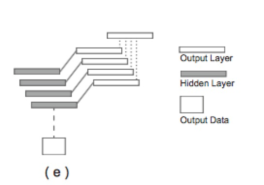
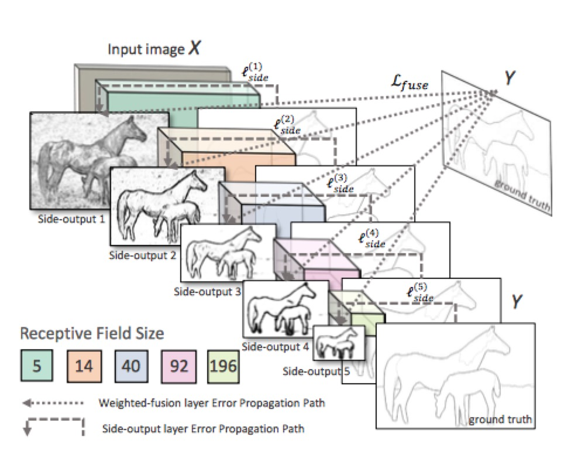
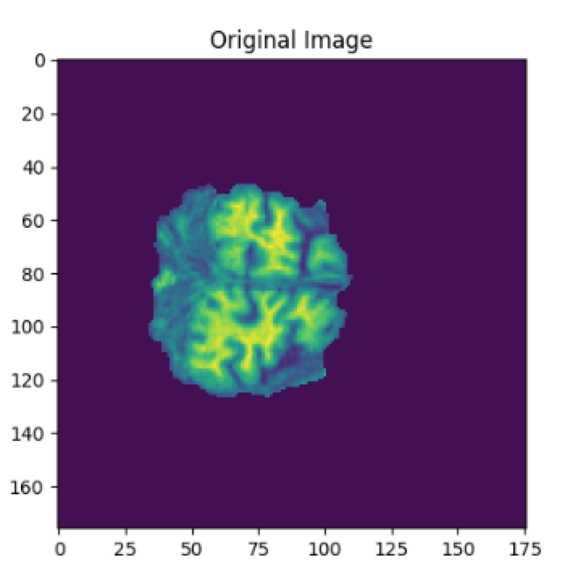
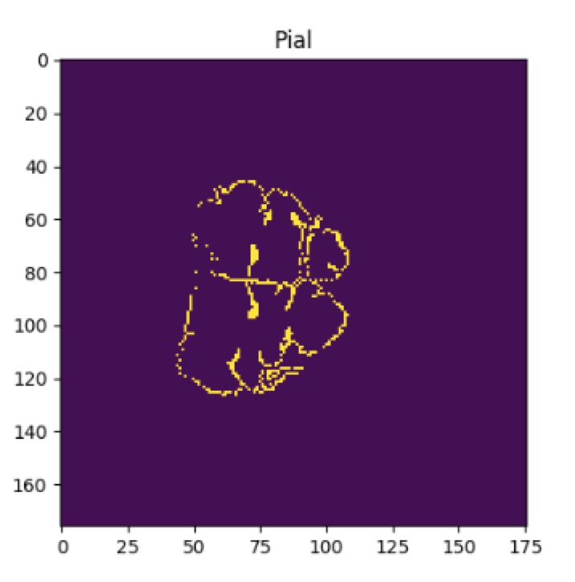
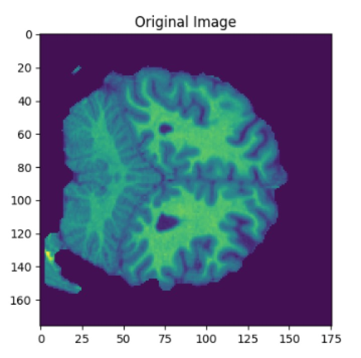
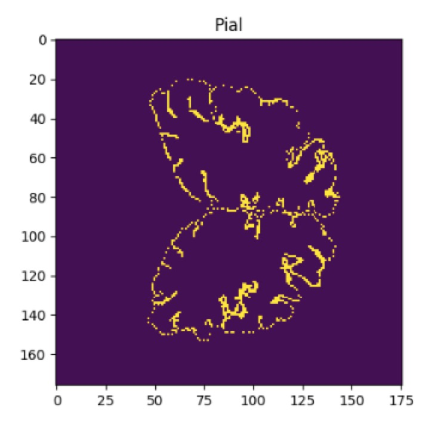
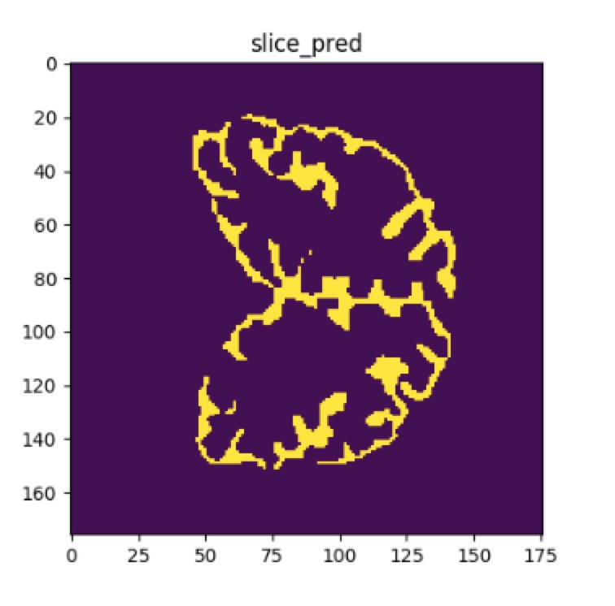

# Brain
## Introduction
In our project, we intend to detect the Inner Cortical Surface and Pial Surface in Magnetic Resonance Image (MRI) of a brain. Inner Cortical Surface is a tessellation based in the cleaned and corrected inner cortical boundary mask; meanwhile, Pial Surface depends on Inner Cortical Surface and the tissue fraction of Grey Matter, White Matter and CSF in the brain. The generation for those two tessellations contributes to the Brain Registration, which is generally used in the biomedical and usually need a long-time computing by previous work. We use two methods to solve the problem. One is 3D patches classification and the other is 2D image edge detection. The first one do not have good result and the second one performs well.

## Methods
We tried two methods to detect surface of brain in MRI. Our training data are 3D brain models. The first method is to cut 3D models into patches and the second method is to cut 3D models into 2D images slice by slice.

### 1. 3D patch
We cut 3D models into patches. And the corresponding label is the central label of the patch. The architecture of this model is simple. 

1) input layer

2) flatten layer

3) full connected layer

4) output layer

In input layer, we input batch of 3D patches. Then in flatten layer we flat the 3D matrix into 1D vector. In full connected layer we increase the dimension of 1D vector. The size of our output layer is 2. The output is one-hot vector of size 2.
### 2. Slice by slice
We cut 3D models into 2D images slice by slice, which means we transfer the problem into finding edge of objects in 2D images. We use Holistically-Nested Edge Detection method[[1]](https://arxiv.org/pdf/1504.06375.pdf).

The architecture of the model is as follows:



The architectures contains five convolutional layers and each is followed by a side output layer. For our MRI image, the distribution of edge and non-edge is extremely biased. About 90% of the label is 0 and only 10% is 1. So, we use class-balanced cross-entropy as our loss function instead of general cross-entropy.

## Experiments

### Dataset
Our dataset is generated from BrainSuite, a collection of open source software tools that enable largely automated processing of MRI of human brain. Each brain has two files. One is 3D matrix of the brain vertices and the other is a list of vertices belonging to edge.

A slice of the 3D matrix is like:

```
array([[0, 0, 0, ..., 0, 0, 0],
       [0, 0, 0, ..., 0, 0, 0],
       [0, 0, 0, ..., 0, 0, 0],
       ..., 
       [0, 0, 0, ..., 0, 0, 0],
       [0, 0, 0, ..., 0, 0, 0],
       [0, 0, 0, ..., 0, 0, 0]], dtype=int16)
```
It is a image like:



The corresponding label is like:

```
[[  41.30926514  117.4752655    24.88306046]
 [  42.18822098  117.37171936   25.00785828]
 [  42.77109909  117.3330307    25.24357986]
 ..., 
 [  79.03147888   90.86765289  149.97180176]
 [  79.74328613   90.50224304  149.8828125 ]
 [  79.18741608   91.3355484   149.72851562]]
```
We convert it to 3D matrix and visulize it like:



These two 3D matrix are the input and output of our network.

### Training

We use seven brains for training and one brain for testing. The batch size is set as 20 and the number of epoch is 200.

### Evaluation
We compare all the output label with the ground-truth label and calculate the accuracy as our evaluation metric.

## Results

### 1. Baseline
We define our baseline model as a model that classifies all label into 0. It has an average test accuracy of 90%.

### 2. 3D patch
The result of this model is bad. The performance is the same as baseline model. It means the model can not learn any feature of a patch to determine whether it is edge or not. We tried using 3D convolutional layer instead of cutting input data into patches. The result is not changed. We think it is likely because the size of each patch is too small to learn the features. So we increase the kernel size of filters of 3D convolutional layer, but the time and memory consumption are both high. It turns out to be a bad model.
### 3. Slice by slice
The test accuracy of the model is 95%, which is higher than baseline.

We visualized our result.

This is the original image:



This is the ground-true label:



This is the label predited:

